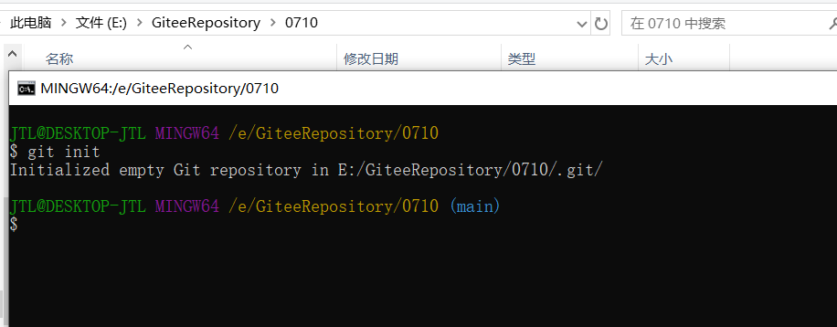
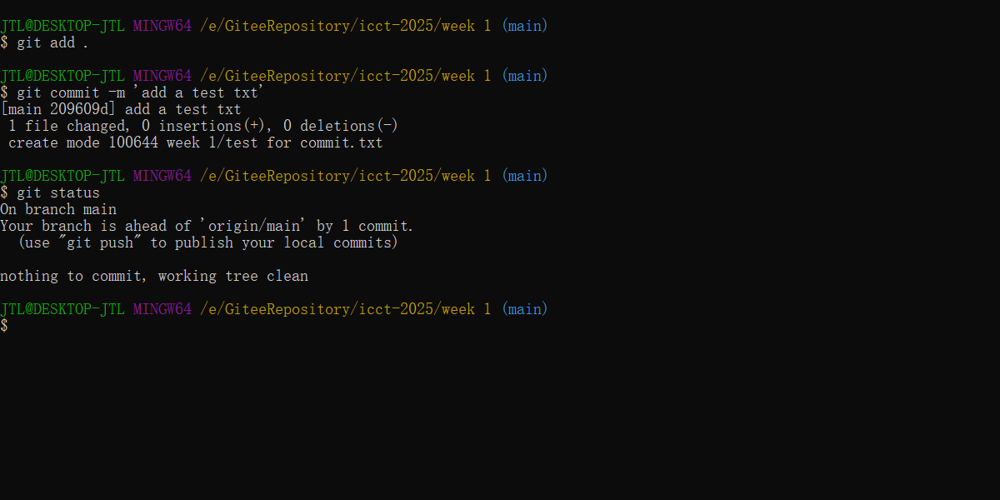
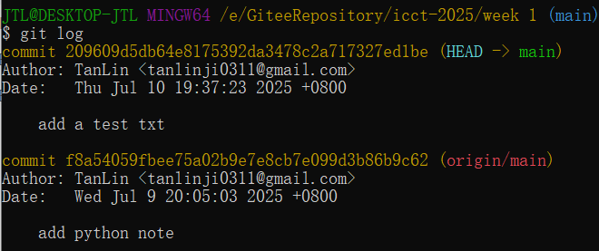
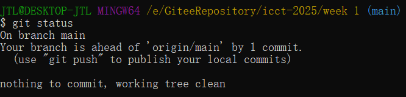
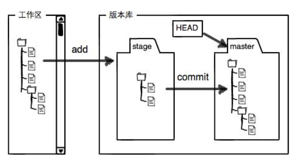

- Git是一个分布式的版本控制系统（相当于游戏中的存档，可以返回存档处），免费开源
- 终端机：供使用者输入命令、与计算机进行交互的

**终端机环境下常见的命令 (Windows)：**

| 命令        | 命令说明                         |
| ----------- | -------------------------------- |
| dir         | 列出当前目录中的所有文件和文件夹 |
| cd          | 切换当前目录或显示当前目录路径   |
| md / mkdir  | 创建新文件夹                     |
| rd / rmdir  | 删除空文件夹                     |
| copy        | 复制文件或目录                   |
| move        | 移动文件或重命名文件             |
| del / erase | 删除一个或多个文件               |
| cls         | 清除终端屏幕内容                 |
| type        | 显示文本文件的内容               |
| echo        | 显示一行文本，或控制命令回显     |
| ipconfig    | 显示网络接口的配置信息           |
| ping        | 测试网络连通性，检测目标主机响应 |
| tracert     | 跟踪数据包到目标主机的传输路径   |
| tasklist    | 显示当前运行的进程列表           |
| taskkill    | 结束指定的进程                   |
| systeminfo  | 显示详细的系统硬件和软件配置信息 |
| chkdsk      | 检查磁盘错误并显示状态报告       |
| format      | 格式化磁盘或分区                 |
| shutdown    | 关闭或重启计算机                 |
| sfc         | 扫描并修复受损的系统文件         |
| attrib      | 显示或修改文件和目录的属性       |

- echo 命令：

    ```Python
    1. 显示普通字符串
    echo "Hello world"
    
    2. 显示结果定向至文件
    echo "Hello world" > myfile.txt
    ```


```Python
cd..    # 返回上一层目录

pwd   # 显示当前所在目录
```


### git修改提交有效

```shell
#  查看当前用户名和邮箱
git config user.name
git config user.email

git config --global user.name "(新的用户名)"
git config --global user.email "123456@qq.com(新的邮箱)"
git config --global user.password "123456(新的密码)"
# 这里的zhangsan和邮箱都是你修改之后的用户名和邮箱
```

### 新建本地仓库

```bash
git init
```



可以看到，终端提示已经在指定目录初始化了一个空的仓库，产生了一个.git文件夹，


提交代码时，所有更改都会保存到.git目录下，同样，如果想删除仓库，直接运行rm-rf.git删除目录就可以了

```bash
rm -rf .git
```

### 提交代码

- git三板斧：add  commit push

```bash
git add .   # 提交所有代码
git add tanlin # 提交tanlin目录
git add tanlin/test.txt  # 提交tanlin目录下的test.txt文件
```

```bash
git reset	# 将暂存区所有文件踢出
```

```
git commit -m "本次提交的说明"
```



```bash
git log # 查看提交日志
```



### 添加git忽略文件

在目标文件夹下新建文件.gitignore，接着将想要忽略的目录或者文件名称写到文件中:

```bash
build/
install/
log/
*.log
```

然后将.gitignore文件提交，这样，install、build和log这三个目录已经被成功忽略掉了。.gitignore除了可以对指定文件夹和文件进行忽略外，还可以使用通配符“*”来忽略某一类的文件，比如在.gitignore中添加.log，就会忽略所有以.log为后缀的文件。

### 查看修改内容

```bash
git status
```



diff指令可以查看所有被修改文件的具体修改情况，代码左侧加号表示新增，减号则表示删除。被修改的文件可能有很多，但我们往往只需要查看某一个文件的更改内容，

```bash
git diff
git diff test.txt
```

暂存区(stage)和分支(master)的比较：

```bash
git diff --cached
```

工作区和版本库里面最新版本的比较：

```bash
git diff HEAD -- <file>
```

### 查看提交日志

```bash
git log
```

简化日志输出信息：

```bash
git log --pretty=oneline
```

### 查看命令历史

```bash
git reflog
```

### 版本回退

##### 回退上个版本

`HEAD`指向的版本就是当前版本，因此，Git允许我们在版本的历史之间穿梭，使用命令`git reset --hard commit_id`。穿梭前，用`git log`可以查看提交历史，以便确定要回退到哪个版本。要重返未来，用`git reflog`查看命令历史，以便确定要回到未来的哪个版本。

```bash
git reset --hard HEAD^
```

以上命令是返回上一个版本，在Git中，用`HEAD`表示当前版本，上一个版本就是`HEAD^`，上上一个版本是`HEAD^^`，往上100个版本写成`HEAD~100`。

##### 回退指定版本号

```bash
git reset --hard commit_id
```

commit_id是版本号，是一个用SHA1计算出的序列

##### 工作区，暂存区和版本库

工作区：在电脑里能看到的目录；

暂存区：从本地仓库到远端仓库的缓冲，允许后悔

版本库：在工作区有一个隐藏目录`.git`，是Git的版本库。 Git的版本库中存了很多东西，其中最重要的就是称为stage（或者称为index）的暂存区，还有Git自动创建的`master`，以及指向`master`的指针`HEAD`。



- `git add`实际上是把文件添加到暂存区
- `git commit`实际上是把暂存区的所有内容提交到当前分支

### 撤销修改

有两种撤销修改的情况：

1. 一种是file自修改后还没有被放到暂存区，现在，撤销修改就回到和版本库一模一样的状态；
2. 一种是file已经添加到暂存区后，又作了修改，现在，撤销修改就回到添加到暂存区后的状态。

##### 丢弃工作区的修改

当你改乱了工作区某个文件的内容，想直接丢弃工作区的修改时，用命令`git checkout -- file`。

```bash
git checkout -- <file>
```

##### 丢弃暂存区的修改

如果不但改乱了工作区某个文件的内容，还添加到了暂存区时，想丢弃修改，分两步：第一步用命令`git reset HEAD file`，再用命令`git checkout -- file`。 第一步，把暂存区的修改撤销掉(unstage)，重新放回工作区：

```bash
git reset HEAD <file>
```

第二步，撤销工作区的修改

```bash
git checkout -- <file>
```

结论：

1. 当你改乱了工作区某个文件的内容，想直接丢弃工作区的修改时，用命令`git checkout -- <file>`。
2. 当你不但改乱了工作区某个文件的内容，还添加到了暂存区时，想丢弃修改，分两步，第一步用命令`git reset HEAD <file>`，就回到了第一步，第二步按第一步操作。
3. 已经提交了不合适的修改到版本库时，想要撤销本次提交，进行版本回退，前提是没有推送到远程库。 总之，就是让这个文件回到最近一次git commit或git add时的状态。

### 删除文件

命令`git rm`用于删除一个文件：

```bash
git rm <file>
```

`git rm <file>`相当于执行:

```bash
rm <file>  
git add <file>
```

##### 误删恢复：

eg: 

- 错误地执行了rm test.txt命令，如果想要恢复test.txt文件，需要执行：

```bash
git checkout -- test.txt
```

这样就把版本库的东西重新协会工作区了

- 误操作执行了`git rm test.txt` ,工作区内容也删除了，恢复：先撤销暂存区修改，重新放回工作区，然后再从版本库写回到工作区：

```bash
git reset HEAD test.txt
git checkout -- test.txt
```

- 确实需要删除文件？执行git commit -m "delete test.txt"，提交后最新的版本库将不包含这个文件

### 分支

##### 创建分支

```bash
git branch <branchname>
```

##### 查看分支

```bash
git branch
```

`git branch`命令会列出所有分支，当前分支前面会标一个*号。

##### 切换分支

```bash
git checkout <branchname>
```

##### 创建后切换分支

```bash
git checkout -b <branchname>
```

##### 合并分支

###### Fast forward合并分支

```bash
git merge <branchname>
```

合并分支时，如果可能，Git会用`Fast forward`模式，但这种模式下，删除分支后，会丢掉分支信息。如果要强制禁用`Fast forward`模式，Git就会在merge时生成一个新的commit，这样，从分支历史上就可以看出分支信息。


###### 

  

