# SAM2环境配置指南

---

## 1. 准备工作

### 1.1 系统要求检查

必须 Windows 10 版本 2004 及更高版本（内部版本 19041 及更高版本）或 Windows 11 才能继续使用如下命令。

查看方法：在键盘上按下`win+R`调出运行窗口，随后输入`winver`命令并回车：

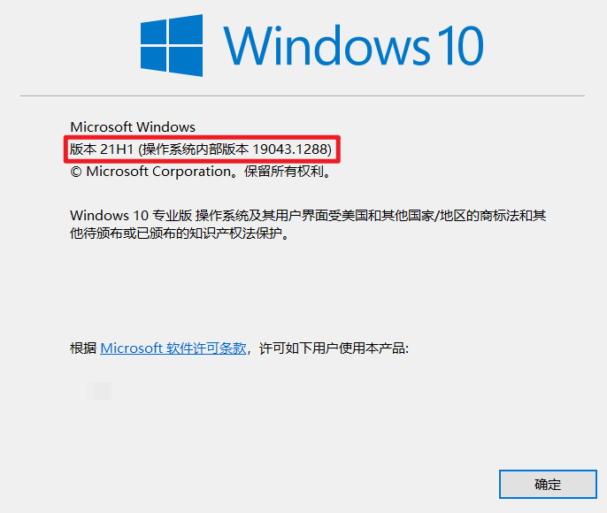

### 1.2 启用适用于Linux的Windows子系统

打开控制面板-->程序-->启用或关闭Windows功能，依次勾选`Hyper-V`、`适用于Linux的Windows子系统`、`虚拟机平台`，然后确认：

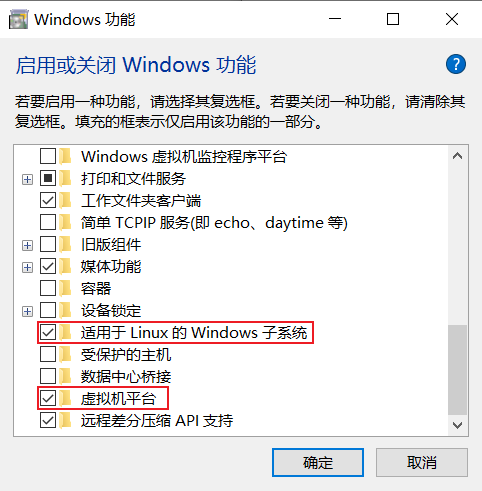

等待操作系统应用所做更改，完后后选择`立即重新启动`：

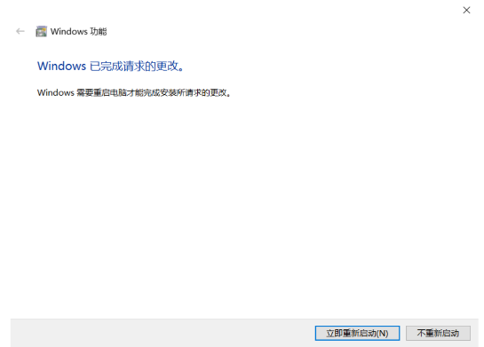

### 1.3 确认已经启用虚拟机功能

打开任务管理器-->性能-->CPU，查看是否已经启动虚拟化：

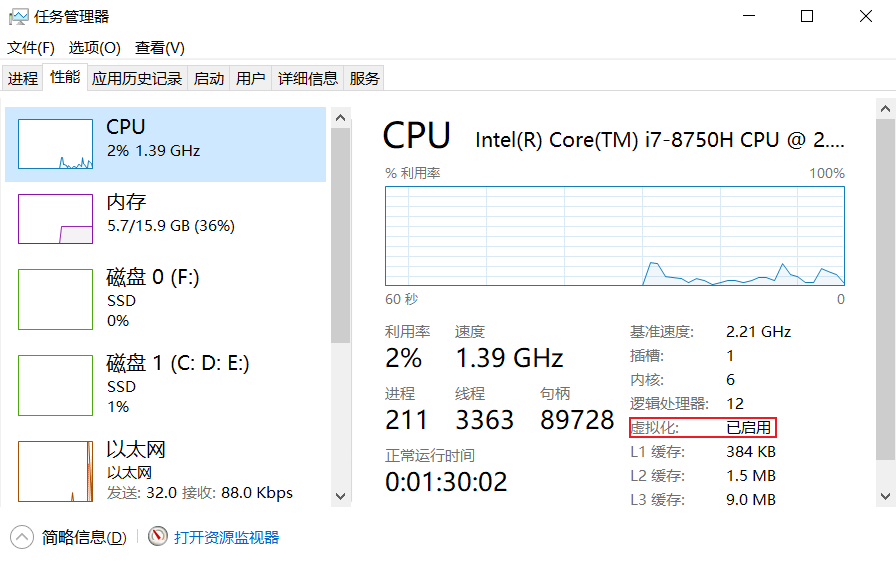

## 2. 下载WSL Ubuntu分发

### 2.1 检查适用于本机的Ubuntu分发版本

按住`Windows + X` 键找到`Windows PowerShell(管理员)`，依次执行下面的命令更新wsl命令

```powershell
wsl --update
wsl --shutdown
```

然后检查适用于本机WSL的Ubuntu分发版本：

```powershell
wsl --list --online
```

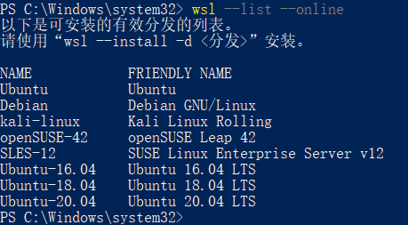

### 2.2 安装适合版本的Ubuntu分发

可以使用`wsl --install -d Ubuntu-20.04`命令行的方式安装Ubuntu分发，但是可能会报错：

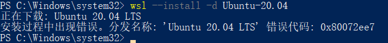

这种情况一般是网络问题，可以选择到微软商店手动下载WSL Ubuntu20.04版本：

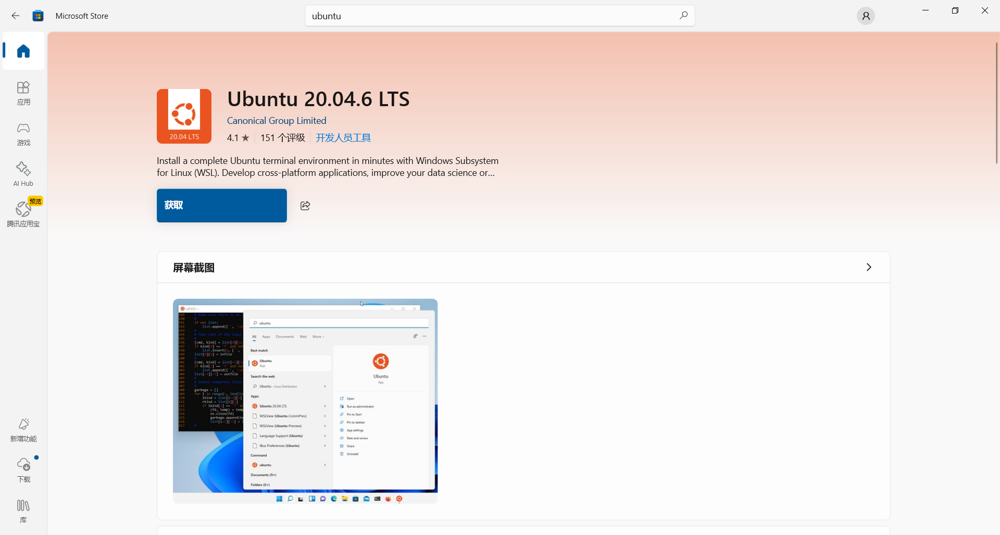

`注意：`这个过程必须退出个人VPN，否则微软商店无法正常运行

### 2.3 配置Ubuntu系统

下载完成后，选择立即启动Ubuntu，此时系统会花几分钟时间配置Ubuntu，然后便可以进行相关设置：

1. 输入UNIX username:

   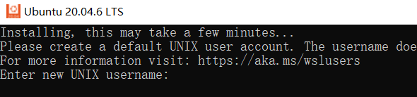

   `注意：`用户名不能以大写字母开头

2. 输入password:（我的是12345）

   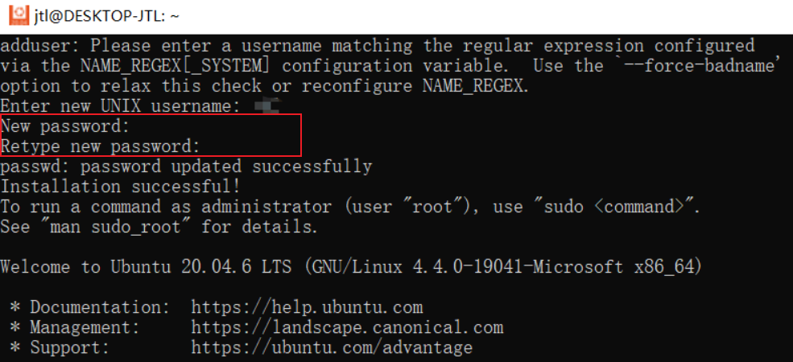

   `注意：`这里输入密码时，后边不会显示任何内容，输入完成后回车即可

3. 在`Windows Powershell(管理员)`中使用命令设置WSL为版本2：

   ```powershell
   wsl.exe --set-version Ubuntu-20.04 2
   ```

   最后一个数字就是版本号，需要将这里的分发版替换为实际下载的分发版

4. 输入密码后就完成了基本的Ubuntu系统设置，可以再次使用wsl命令`wsl -l -v`检查WSL Ubuntu版本号：

   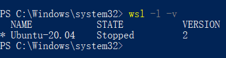

   

### 2.4 (可选)更改Ubuntu系统位置

由于微软商店默认是将Ubuntu系统下载到C盘，但是进行大模型训练通常需要占用较大内存，因此可以将Ubuntu转移到其他非系统盘。

方法1（不推荐）：按住 `Windows + I`打开设置->应用-->Ubuntu-->移动:


选择合适的盘符后移动，移动后会在目标盘符下创建两个目录：

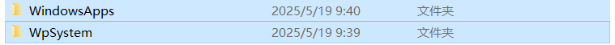

方法2：在PowerShell(管理员)下执行如下命令：

1. 确认WSl 已经关闭：

   ```base
   wsl --shutdown
   ```

2. 在其他非系统盘新建一个目录，用于暂存WSL文件（这个目录在完成系统钱以后可以删除）：

   ```base
   wsl --export Ubuntu-22.04 E:\Ubuntu\Ubuntu.tar
   ```

   `注意：`必须现在D盘下创建了Ubuntu后才能执行，因为这条命令不会自动创建目录，命令中的`Ubuntu-22.04`修改为自己的Ubuntu系统版本，可以通过`wsl-l-v`命令查看自己的版本号

3. 确定在此目录下可以看见备份Ubuntu.tar文件之后，注销原有的wsl：

   ```base
   wsl --unregister Ubuntu-22.04
   ```

4. 将第2步的备份文件迁移到自己想要放置的非系统盘位置中去：

   ```base
   wsl --import Ubuntu-22.04 F:\Ubuntu E:\Ubuntu\ubuntu.tar
   ```

   `注意：`命令中的最后一部分`E:\Ubuntu\ubuntu.tar`对应第2步自己的文件备份位置，命令中的`F:\Ubuntu`对应自定义的安装位置，最后会出现这么一个结果：

   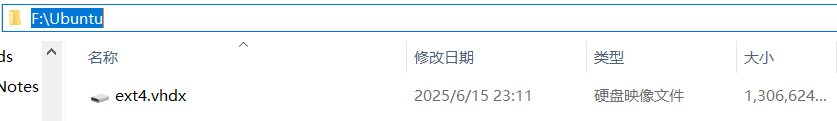

   说明系统迁移成功，这个文件以后就不要动了。
   
5. （如果已经配置好了conda环境，需要进行这一步）设置默认用户，这个用户名也就是之前wsl里的用户名，如果不设置这一步，会找不到conda位置，导致以前配置的环境消失，需要更复杂的操作才能找到conda。

   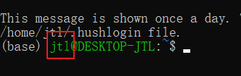

   @符号前的就是你之前的用户名，然后执行以下命令：

   ```bash
   ubuntu2204.exe config --default-user jtl  # jtl就是自己的用户名
   ```

   在导入任意盘linux系统时，我是用的默认名字，所以这里是ubuntu2204.exe；如果你起的名字是Ubuntu-20.04，那这里就是ubuntu2004.exe；如果你起的名字是ubuntu-18.04，那这里就是ubuntu1804.exe，名字可以在windows powershell通过 `wsl -l -v` 命令查看：

   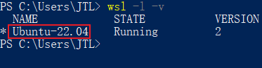

   

## 3. 在Ubuntu中安装Anaconda 3 

### 3.1 确认anaconda版本

在 https://repo.anaconda.com/archive/ 网站中找到想要安装的anaconda 3的版本(后缀名为.sh)，并复制其文件名：

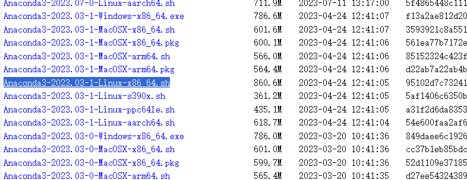

### 3.2 下载Anaconda安装脚本

打开Ubuntu终端，使用wget命令下载Anaconda的安装脚本：

```shell
wget https://repo.anaconda.com/archive/Anaconda3-2023.03-1-Linux-x86_64.sh
```

`注意:`将最后一部分替换为刚刚选择的版本名称。

这是使用anaconda官网的，下载速度比较慢，可以使用清华大学的镜像源：

```shell
wget https://mirrors.tuna.tsinghua.edu.cn/anaconda/archive/Anaconda3-2023.03-1-Linux-x86_64.sh
```

### 3.3 运行Anaconda安装脚本

下载完成后，使用`bash`命令运行脚本：

```shell
bash Anaconda3-2023.03-1-Linux-x86_64.sh
```

`注意:`将最后一部分替换为刚刚选择的版本名称。

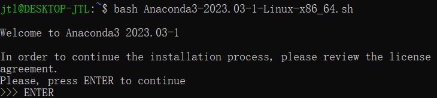

### 3.4 遵循安装向导

回车键按下后，会弹出相关协议，可以一直回车翻阅协议，直到最后输入yes接受许可协议，然后可以按下回车键以接受默认安装位置或者自定义新位置：

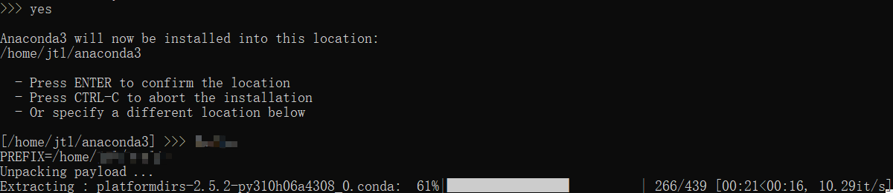

### 3.5 初始化Anaconda

安装结束后，安装程序将询问你是否希望运行conda init，这将允许你在任何新的终端会话中使用conda。输入yes以继续：

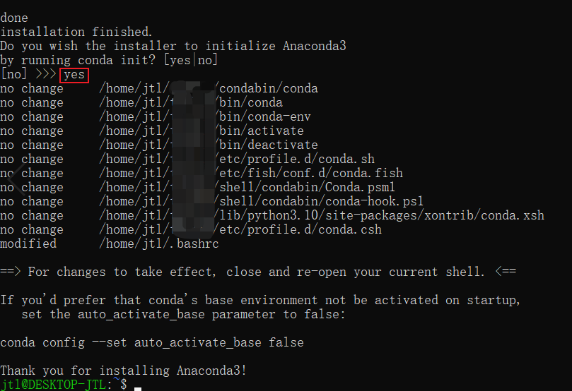

### 3.6 激活配置

可以选择重新启动Ubuntu系统或者键入以下命令来激活配置：

```shell
source ~/.bashrc
```

### 3.7 确认Anaconda安装成功

激活配置后，命令提示符前会显示(base)，这是conda的默认环境，还可以使用`conda list` 命令检查安装的包：

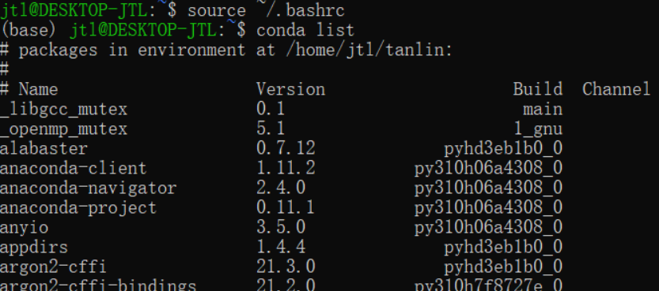

### 3.8 创建新的环境

为了避免以后出错而影响到原来的默认环境，建议新建一个环境：

```shell
> conda create -n DL python=3.11  # -n是name的缩写 roomName可以自己取名字，python=3.11是自己指定的python版本
>
> conda activate DL   # 进入新的环境
```


## 4. 在Anaconda中安装CUDA

### 4.1 确认驱动信息

在桌面空白处，右键-->NVIDIA控制面板-->左下角系统信息-->组件-->3D设置，查看Cuda版本：

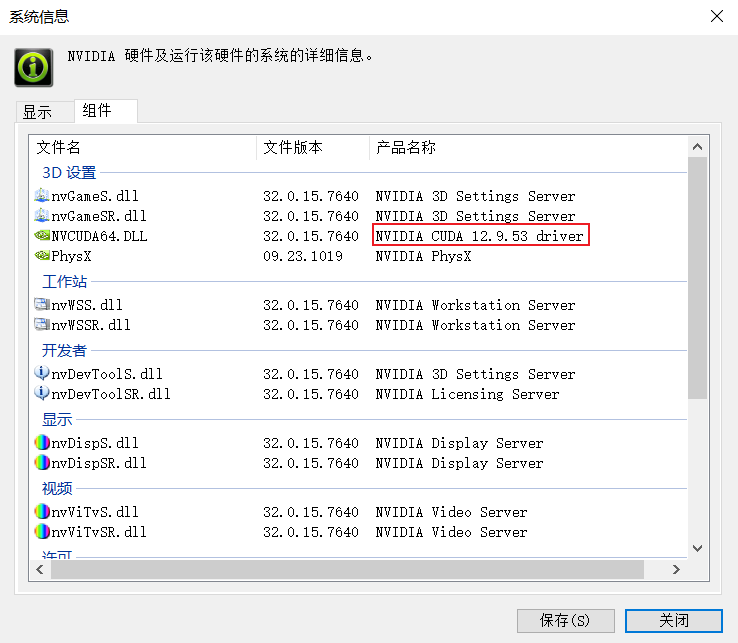

或者在`cmd命令行`中使用命令：`nvidia-smi`：

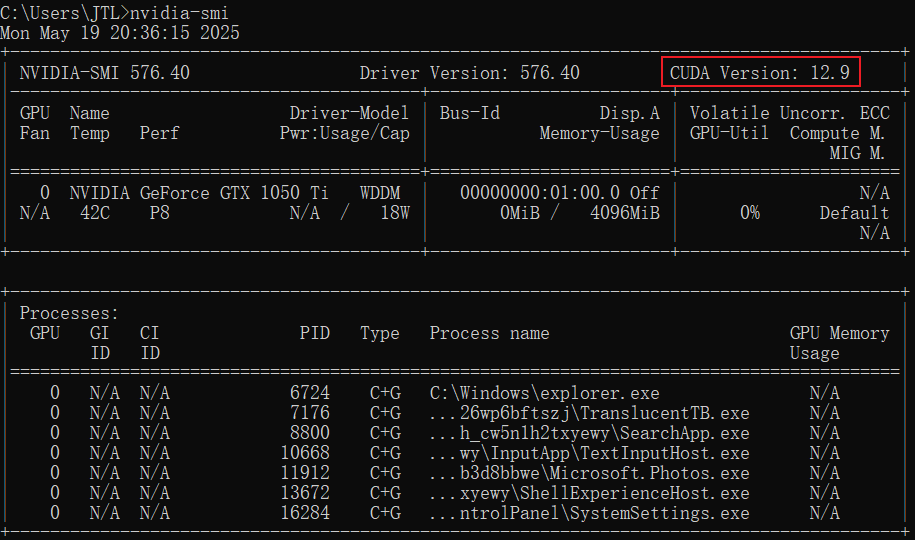

确保已经安装nvidia驱动，只需在Windows上安装好GPU驱动程序，WSL2上便可以获得驱动的支持。

### 4.2 安装CUDA ToolKit

前往https://developer.nvidia.com/cuda-toolkit-archive找到对应的CUDA ToolKit，并选择适合自己电脑的cuda：

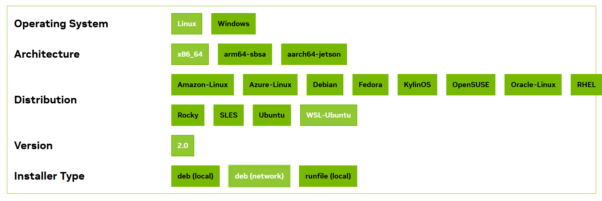

选择好相关信息后，网页下边会出现相关的命令，把这些命令依次复制自己新建的anaconda环境中执行：

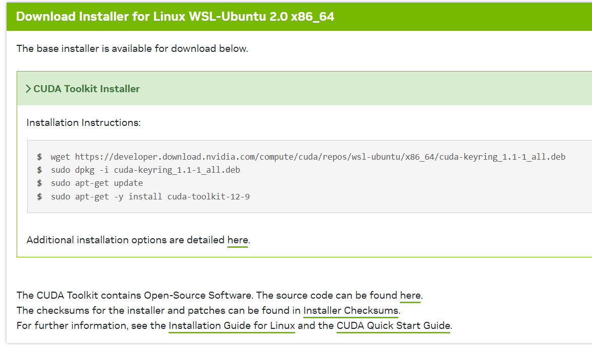

Installation Instructions：

```shell
wget https://developer.download.nvidia.com/compute/cuda/repos/wsl-ubuntu/x86_64/cuda-keyring_1.1-1_all.deb
sudo dpkg -i cuda-keyring_1.1-1_all.deb
sudo apt-get update
sudo apt-get -y install cuda-toolkit-12-9
```

只需遵循安装向导一步步执行即可.


如果在第一步`wget`遇到问题：

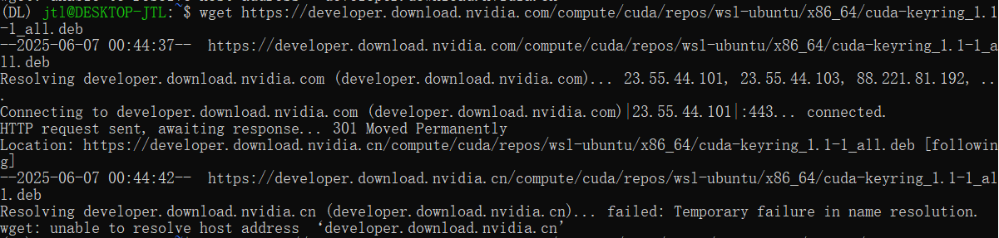

仅需将DNS修改为：*Google DNS*： 8.8.8.8，8.8.4.4


第三步和最后一步需要花费一定的时间，最后一步花费的时间最长（几分钟到十几分钟）

## 5. 在Anaconda中安装Pytorch

在官网https://pytorch.org/get-started/locally/中找到对应自己系统的torch版本：

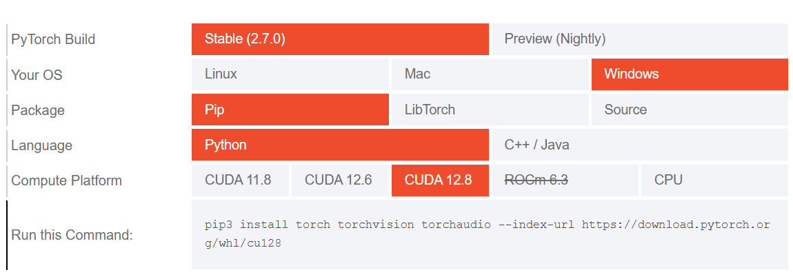

我的CUDA版本是12.9，但这里最高是12.8，经验证，12.8依然可以正确安装并运行。

```shell
pip3 install torch torchvision torchaudio --index-url https://download.pytorch.org/whl/cu128
```

将命令复制到Anaconda自己的环境中执行，执行完成后可通过`conda list`查看torch是否安装完成

这一步也需要花费较长时间

## 6. 安装SAM2大模型

前往Sam2官网https://github.com/facebookresearch/sam2找到Installation部分，这里是关于sam2的安装教程，依次执行下面的命令：

```shell
git clone https://github.com/facebookresearch/sam2.git && cd sam2

pip install -e .
```

## 7. 链接WSL2和VSCode

在wsl ubuntu中，先进入想要打开的文件目录，比如进入sam2，然后通过 `code .`命令即可启动VS Code:

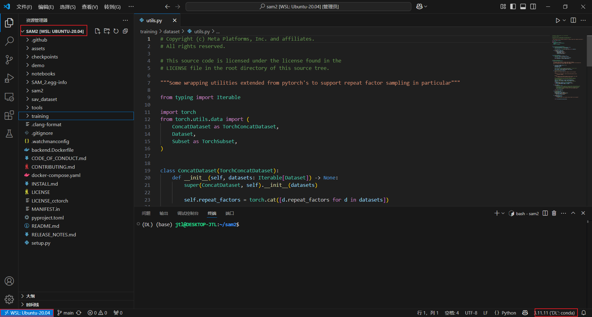

VSCode中需要安装的插件：

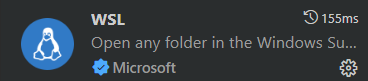

