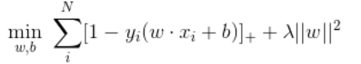

# 机器学习笔记

> 课程和资料：https://github.com/Fafa-DL/Lhy_Machine_Learning

### 一、 机器学习基础

1. 什么是机器学习？

   机器学习就是让机器具备找一个函数的能力（机器具备有学习的能力）

   eg. 以图像识别为例，图像识别函数的输入是一张图片，输出是这个图片里面的内容

2. （机器学习要完成的常见任务）随着要找的函数不同，机器学习有不同的类别：

   1）回归（regression）：要找的函数的输出是一个数值，一个标量（scalar）

   2）分类（classification）：分类任务要让机器做选择题；人类先准备好一些选项，这些选项称为类别（class），现在要找的函数的输出就是从设定好的选项里面选择一个当作输出，该任务称为分类

   3）结构化学习（structured learning）：机器不只是要做选择题或输出一个数字，而是产生一个有结构的物体，比如让机器画一张图，写一篇文章

3. 机器学习是怎么找到函数的？——一个简单的案例

   ​		假设有人想要通过视频平台赚钱，他会在意频道有没有流量，这样他才会知道他的获利。假设后台可以看到很多相关的信息，比如：每天点赞的人数、订阅人数、观看次数。根据一个频道过往所有的信息可以预测明 天的观看次数。找一个函数，该函数的输入是后台的信息，输出是隔天这个频道会有的总观看的次数. 

   - step1：写出一个带有未知参数的函数 *f*，其能预测未来观看次数

   

   其中，*y* 是准备要预测的东西，要预测的是今天这个频道总共观看的人，*y* 就假 设是今天总共的观看次数。*x*1 是这个频道，前一天总共的观看次数，*y* 跟 *x*1 是数值，*b* 跟 *w* 是未知的参数，它是准备要通过数据去找出来的，*w* 跟 *b* 是未知的，只是猜测的。

   在机器学习里，把这种带有未知参数的函数称为`模型（model）`，`特征（feature）` *x*1 是这个函数里面已知的，它是来自于后台的信息， *w* 跟 *b* 是未知的参数。*w* 称为`权重（weight）`，`b称为偏置（bias）`。

   - step2：定义损失（loss）函数，由第一步可知，模型就是那个带有未知参数的函数 y = b + wx1，损失是函数 *L*(*b, w*)，其输入是模型参数 *b* 跟 w 。

##### 损失函数

​		损失函数（loss function）是用来估量模型的预测值f(x)与真实值Y的不一致程度，它是一个非负实值函数,通常使用L(Y, f(x))来表示，损失函数越小，模型的鲁棒性就越好。损失函数是**经验风险函数**的核心部分，也是**结构风险函数**重要组成部分。模型的结构风险函数包括了经验风险项和正则项，通常可以表示成如下式子：

其中，前面的均值函数表示的是经验风险函数，L代表的是损失函数，后面的Φ是正则化项（regularizer）或者叫惩罚项（penalty term），它可以是L1，也可以是L2，或者其他的正则函数。整个式子表示的意思是找到使目标函数最小时的θ值。

​		损失函数旨在表示出logit和label的差异程度，不同的损失函数有不同的表示意义，也就是在最小化损失函数过程中，logit逼近label的方式不同，得到的结果可能也不同。

​		一般情况下，softmax和sigmoid使用交叉熵损失（logloss），hingeloss是SVM推导出的，hingeloss的输入使用原始logit即可。

**1. LogLoss对数损失函数（逻辑回归，交叉熵损失）**

​		平方损失函数可以通过线性回归在假设样本是高斯分布的条件下推导得到，而逻辑回归得到的并不是平方损失。在逻辑回归的推导中，它假设样本服从伯努利分布（0-1分布），然后求得满足该分布的似然函数，接着取对数求极值等等。而逻辑回归并没有求似然函数的极值，而是把极大化当做是一种思想，进而推导出它的经验风险函数为：最小化负的似然函数（即max F(y, f(x)) —> min -F(y, f(x)))。从损失函数的视角来看，它就成了log损失函数了。log损失函数的标准形式：

上述两种形式都是log损失函数的标准形式，取对数是为了方便计算极大似然估计，因为在MLE（最大似然估计）中，直接求导比较困难，所以通常都是先取对数再求导找极值点。损失函数L(Y, P(Y|X))表达的是样本X在分类Y的情况下，使概率P(Y|X)达到最大值（换言之，就是利用已知的样本分布，找到最有可能（即最大概率）导致这种分布的参数值；或者说什么样的参数才能使我们观测到目前这组数据的概率最大）。因为log函数是单调递增的，所以logP(Y|X)也会达到最大值，因此在前面加上负号之后，最大化P(Y|X)就等价于最小化L了。

​		逻辑回归的P(Y=y|x)表达式如下（为了将类别标签y统一为1和0，下面将表达式分开表示）：

将它带入到上式，通过推导可以得到logistic的损失函数表达式，如下：

逻辑回归最后得到的目标式子如下：

注意：softmax使用的即为交叉熵损失函数，binary_cossentropy为二分类交叉熵损失，categorical_crossentropy为多分类交叉熵损失，当使用多分类交叉熵损失函数时，标签应该为多分类模式，即使用one-hot编码的向量。

**2. 平方损失函数（最小二乘法, Ordinary Least Squares ）**

​		最小二乘的基本原则是：最优拟合直线应该是使各点到回归直线的距离和最小的直线，即平方和最小。换言之，OLS是基于距离的，而这个距离就是我们用的最多的欧几里得距离。为什么它会选择使用欧式距离作为误差度量呢（即Mean squared error， MSE），主要有以下几个原因：

- 简单，计算方便；
- 欧氏距离是一种很好的相似性度量标准；
- 在不同的表示域变换后特征性质不变。

平方损失（Square loss）的标准形式如下：

当样本个数为n时，此时的损失函数变为：

`Y-f(X)`表示的是残差，整个式子表示的是残差的平方和，而我们的目的就是最小化这个目标函数值（注：该式子未加入正则项），也就是最小化残差的平方和（residual sum of squares，RSS）。

​		而在实际应用中，通常会使用均方差（MSE）作为一项衡量指标，公式如下：

**3. 指数损失函（Adaboost）**

​		在Adaboost中，经过m此迭代之后，可以得到fm(x):

​		Adaboost每次迭代时的目的是为了找到最小化下列式子时的参数α 和G：

​		而指数损失函数（exp-loss）的标准形式如下：

​		Adaboost的目标式子就是指数损失，在给定n个样本的情况下，Adaboost的损失函数为：

**4. Hinge损失函数（SVM）**

在线性支持向量机中，最优化问题可以等价于下列式子：

下面来对式子做个变形，令：

于是，原式就变成了：

如若取λ=1/(2C)，式子就可以表示成：

Hinge 损失函数的标准形式：

——

其他损失函数：https://zhuanlan.zhihu.com/p/58883095

### 二、元学习

​		**元学习（Meta Learning）**指 learn to learn，我们希望机器根据过去任务上汲取的经验变成更厉害的学习者，学习到学习的技巧（而不只是学习如何执行特定任务）。这样，当新的任务来临时，机器可以学习得更快更好。换言之，我们希望能从以往的经验中明确地学习到提高下游学习效率的先验。

​		元学习和**终身学习（Life-long Learning）**的异同点：

​		- 共同点：都是先让机器看过很多任务，希望机器能够在新的任务上仍然做的好

​		- 不同点：终身学习用同一个模型学习，希望同一个模型能同时学会很多技能；元学习中，不同的任务有不同模型，希望机器可以从过去的学习经验中学到一些共用的先验知识，使得在训练新任务所用的模型时可以训练得又快又好。

​		在标准的监督学习过程中，我们通过**学习算法（Learning Algorithm）**得到模型，这个模型可以被看作是一个映射函数，输入样本数据，输出预测标签。而学习算法帮助找到这个映射函数的一组参数，使得函数可以近似真实的映射关系；在元学习中，学习算法也被看作一个函数，这个函数的输入是训练数据，输出另一个函数，这个输出的函数就是模型。

​		在模型的常规训练过程中，很多的步骤是人为手工设计的，例如网络架构、初始化方法、参数更新方法等，选择不同的设计导致了不同的学习算法。元学习希望不要人为定义这些选项，而是让机器学习出最好的选项。

​		机器学习通常使用`损失函数（Loss Function）`来评估模型的好坏，元学习也可以定义一个类似的指标来评估学习算法。如下图所示，我们找能使 L(F) 最小的学习算法 F，之后将学习算法 F 用在测试任务上，将测试任务的训练集输入到学习算法 F 中，得到模型 f，然后将测试任务的测试集输入到模型 f 得到结果，通过此结果评估学习算法的好坏。

##### 数据集的划分

​		监督学习和元学习需要的数据集不同。对于监督学习，以猫狗图片分类为例，需要训练集和测试集，每个数据集中有很多猫狗图片；而元学习，需要准备的不是训练集和测试集，而是训练任务和测试任务（有时候也需要用于验证的任务），每个任务中各自有训练集和测试集。这样，我们通过训练任务让机器在类别发生变化时保持模型的泛化能力，在测试任务上，面对全新的类别时，不需要变动已有的模型，就可以完成分类。

元学习常常与小样本学习（Few-shot Learning）一起讨论。小样本学习是元学习在监督学习领域的应用，要解决的问题是希望机器学习模型在学习了一定类别的大量数据后，对于新的类别，只需要非常少量的样本就能快速学习。

​		元学习常用的一个数据集是 [Omniglot](https://github.com/brendenlake/omniglot)，拥有 1623 个不同的符号种类，每类符号有 20 个不同的样本。Omniglot 在应用于小样本学习的分类任务上时，常常遵循 N-ways K-shot classification 的方法，即在训练阶段，会在训练集中随机抽取`N`个类别，每个类别`K`个样本，总共`N*K`个样本作为一个训练任务的`支撑集（support set）`；再从这`N`个类别剩余的数据中抽取一批样本，作为该训练任务的`查询集（query set）`，来训练模型从`N*K`个数据中学会如何区分这`N`个类别。测试任务的构建同理。

##### 元学习技术

两种元学习算法：

- `MAML`: Chelsea Finn, Pieter Abbeel, Sergey Levine, "[Model-Agnostic Meta-Learning for Fast Adaptation of Deep Networks](https://arxiv.org/pdf/1703.03400.pdf)", ICML, 2017
- `Reptile`: Alex Nichol, Joshua Achiam, John Schulman, "[On First-Order Meta-Learning Algorithms](https://arxiv.org/pdf/1803.02999.pdf)", arXiv, 2018

###### **MAML:**

​		过去的神经网络的初始化参数都是从某一个分布中采样得到，`MAML（Model-Agnostic Meta-Learning）`算法要做的事情是学习出一组用于初始化的最好的神经网络参数 $\phi$。注意，虽然 MAML 可以翻译为“模型无关的元学习”，但是 MAML 要求训练和测试阶段的模型结构必须一致，因为它们需要共用同一组初始化参数。“模型无关”指训练和测试阶段的模型结构只需要一致，就可以自由选择使用的模型结构。

MAML 有以下优点：

- 不需要为元学习过程引入额外的、需要学习的参数；
- 可以在任何适合用基于梯度下降方法训练的模型，以及不同的可微分任务（包括分类、回归和强化学习）上使用；
- 方法只生成一个初始化权重，可以使用任意数量的数据和梯度下降步骤来执行自适应。

MAML算法的流程：

1. 随机初始化 $\phi$（即得到 $\phi^0$）；
2. 从任务的概率分布中采样得到一批任务；
3. 对于这批任务中的每个任务，计算 $\nabla_{\phi} l(\phi)$，并得到对于该任务得到的自适应参数 $\hat{\theta}=\phi-\varepsilon \nabla_{\phi} l(\phi)$；
4. 更新 $\phi$：$\phi \leftarrow \phi-\eta \nabla_{\phi} L(\phi)$；
5. 循环第 2～4 步，直到训练结束。

注意，我们不在意 $\phi$ 在训练任务上的直接表现，而在意用 $\phi$ 训练出来的 $\widehat{\theta}^{n}$ 在训练任务上的表现。模型预训练（Model Pre-training）看起来与 MAML 有相似之处，区别在于模型预训练试图找到在所有任务上直接表现最好的 $\phi$，但并不保证拿 $\phi$ 去训练以后会得到好的 $\widehat{\theta}^{n}$。

从第 3 步的公式 $\hat{\theta}=\phi-\varepsilon \nabla_{\phi} l(\phi)$ 可以看到，MAML 在对于每个任务进行参数的更新时只更新一次，原因有：

- 元学习的训练的计算量很大，只更新一次参数能够提高计算速度；
- 假设 MAML 能学习出一个非常好的初始化参数，我们希望能够只进行一次参数更新就得到最好的模型参数，因此将其作为目标来看能否实现；
- 在实际测试时，如果只更新一次时效果不好，可以多更新几次；
- 小样本学习的数据很少，多次更新参数容易导致过拟合。

MAML算法的数学推导过程：

重复一遍 MAML 的训练方法：

$$\begin{array}{l}{\phi \leftarrow \phi-\eta \nabla_{\phi} L(\phi)} \\ {L(\phi)=\sum_{n=1}^{N} l^{n}\left(\hat{\theta}^{n}\right)} \\ {\hat{\theta}=\phi-\varepsilon \nabla_{\phi} l(\phi)}\end{array}$$

这里，我们来推导一下梯度项 $\nabla_{\phi} L(\phi)$ 是什么样子。将 $L(\phi)$ 替换，并将求和提取出来，则有：

$$\nabla_{\phi} L(\phi)=\nabla_{\phi} \sum_{n=1}^{N} l^{n}\left(\hat{\theta}^{n}\right)=\sum_{n=1}^{N} \nabla_{\phi} l^{n}\left(\hat{\theta}^{n}\right)$$

梯度是一个向量，其每一个维度代表了某一个参数对损失函数的偏微分的结果，即

$$\nabla_{\phi} l(\hat{\theta})=\left[\begin{array}{c}{\partial l(\hat{\theta}) / \partial \phi_{1}} \\ {\partial l(\hat{\theta}) / \partial \phi_{2}} \\ {\vdots} \\ {\partial l(\hat{\theta}) / \partial \phi_{i}}\end{array}\right]$$

其中，

$$\frac{\partial l(\hat{\theta})}{\partial \phi_{i}}=\sum_{j} \frac{\partial l(\hat{\theta})}{\partial \hat{\theta}_{j}} \frac{\partial \hat{\theta}_{j}}{\partial \phi_{i}}$$

$\phi_{i}$ 是学习到的初始参数，它通过影响 $\hat{\theta}_{1}, \hat{\theta}_{2}, \dots, \hat{\theta}_{j}$ 来最终影响 $l(\hat{\theta})$。

$\frac{\partial l(\hat{\theta})}{\partial \hat{\theta}_j}$ 与损失函数的形式，以及训练任务中的测试集有关，可以算出。现在来看 $\frac{\partial \hat{\theta}_{j}}{\partial \phi_{i}}$ 。从式子

$$\widehat{\theta}=\phi-\varepsilon \nabla_{\phi} l(\phi)$$

中选择一个维度，则有，

$$\hat{\theta}_{j}=\phi_{j}-\varepsilon \frac{\partial l(\phi)}{\partial \phi_{j}}$$

当 $i \neq j$ 时，

$$\frac{\partial \hat{\theta}_{j}}{\partial \phi_{i}}=-\varepsilon \frac{\partial l(\phi)}{\partial \phi_{i} \partial \phi_{j}}$$

而如果 $i=j$，则有

$$\frac{\partial \hat{\theta}_{j}}{\partial \phi_{i}}=1-\varepsilon \frac{\partial l(\phi)}{\partial \phi_{i} \partial \phi_{j}}$$

这样，我们就可以计算来求 $\frac{\partial l(\hat{\theta})}{\partial \phi_{i}}$ 了。但是，在这个过程中，我们需要进行二次微分来计算 $\frac{\partial l(\phi)}{\partial \phi_{i} \partial \phi_{j}}$，非常花时间。因此，提出 MAML 的原论文考虑将其忽略（文中写作 using a first-order approximation），即 $i \neq j$ 时，$\frac{\partial \hat{\theta}_{j}}{\partial \phi_{i}} \approx 0$；$i=j$ 时，$\frac{\partial \hat{\theta}_{j}}{\partial \phi_{i}} \approx 1$。因此，只需要考虑 $i=j$ 的情况，即

$$\frac{\partial l(\hat{\theta})}{\partial \phi_{i}}=\sum_{j} \frac{\partial l(\hat{\theta})}{\partial \hat{\theta}_{j}} \frac{\partial \hat{\theta}_{j}}{\partial \phi_{i}} \approx \frac{\partial l(\hat{\theta})}{\partial \hat{\theta}_{i}}$$

因此。就变成损失函数对 $\hat{\theta}$ 做偏微分：

$$\nabla_{\phi} l(\hat{\theta})=\left[\begin{array}{c}{\partial l(\hat{\theta}) / \partial \phi_{1}} \\ {\partial l(\hat{\theta}) / \partial \phi_{2}} \\ {\vdots} \\ {\partial l(\hat{\theta}) / \partial \phi_{i}}\end{array}\right]=\left[\begin{array}{c}{\partial l(\hat{\theta}) / \partial \hat{\theta}_{1}} \\ {\partial l(\hat{\theta}) / \partial \hat{\theta}_{2}} \\ {\vdots} \\ {\partial l(\hat{\theta}) / \partial \hat{\theta}_{i}}\end{array}\right]=\nabla_{\hat{\theta}} l(\hat{\theta})$$

原论文表明这种优化方法使得计算速度提升了约 33%。并且通过测试发现，算法的效果没有受到明显的影响。

###### **Reptile：**

Reptile 的训练过程如下：

1. 随机初始化 $\phi$（即得到 $\phi^0$）；
2. 从任务的概率分布中采样得到一批任务；
3. Reptile 在具体任务上的参数更新方式与 MAML 相同，只是不限制在一个训练任务上的参数更新次数，因此我们**多次**更新参数，得到 $\hat{\theta}^m$；
4. 让 $\phi^{0}$ 沿着 $\phi^{0}$ 到 $\hat{\theta}^m$ 的方向更新一次，得到 $\phi^{1}$；
5. 循环第 2～4 步，直到训练结束。

可以看到，Reptile 的过程与模型预训练有相似之处。为了区分 Reptile、MAML 和模型预训练，我们有下图所示例子：

可以看到，当我们要决定初始参数 $\phi$ 的更新方向时，我们先利用采样得到的训练任务进行两次更新，方向分别为 $g_1$ 和 $g_2$。那么，模型预训练中的 $\phi$ 更新方向为 $g_1$，MAML 中的 $\phi$ 更新方向为 $g_2$，而 Reptile 中的 $\phi$ 更新方向为 $g_1 + g_2$（当然，如之前所说，Reptile 没有限制只能走两步，这里只是以两次更新为例）。

### 三、 梯度下降算法

