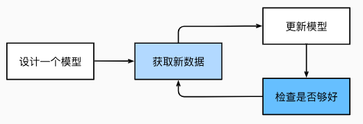
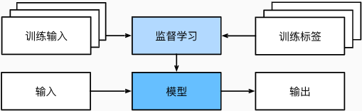
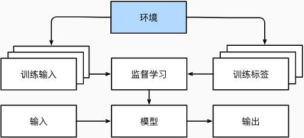
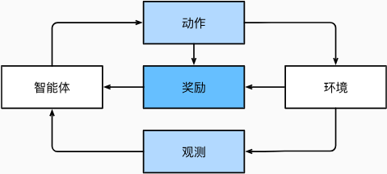

### 一、引言

参数可以被看作旋钮，旋钮的转动可以调整程序的行为。 任一调整参数后的程序被称为*模型*（model）。 通过操作参数而生成的所有不同程序（输入-输出映射）的集合称为“模型族”。 使用数据集来选择参数的元程序被称为*学习算法*（learning algorithm）。

模型训练的过程：

1. 从一个随机初始化参数的模型开始，这个模型基本没有“智能”；
2. 获取一些数据样本（例如，音频片段以及对应的是或否标签）；
3. 调整参数，使模型在这些样本中表现得更好；
4. 重复第（2）步和第（3）步，直到模型在任务中的表现令人满意。

这种“通过用数据集来确定程序行为”的方法可以被看作*用数据编程*（programming with data）。 比如，我们可以通过向机器学习系统，提供许多猫和狗的图片来设计一个“猫图检测器”。 检测器最终可以学会：如果输入是猫的图片就输出一个非常大的正数，如果输入是狗的图片就会输出一个非常小的负数。 如果检测器不确定输入的图片中是猫还是狗，它会输出接近于零的数。

### 二、机器学习中的关键组件

机器学习主要包含以下组件：

（1）可以用来学习的*数据*（data）；

（2）如何转换数据的*模型*（model）；

（3）一个*目标函数*（objective function），用来量化模型的有效性；

（4）调整模型参数以优化目标函数的*算法*（algorithm）。

##### 2.1 数据

 		每个数据集由一个个*样本*（example, sample）组成，大多时候，它们遵循独立同分布(independently and identically distributed, i.i.d.)。 样本有时也叫做*数据点*（data point）或者*数据实例*（data instance），通常每个样本由一组称为*特征*（features，或*协变量*（covariates））的属性组成。 机器学习模型会根据这些属性进行预测。 在上面的监督学习问题中，要预测的是一个特殊的属性，它被称为*标签*（label，或*目标*（target））。	

​		与传统机器学习方法相比，深度学习的一个主要优势是可以处理不同长度的数据。

​		一般来说，拥有越多数据的时候，工作就越容易。但，仅仅拥有海量的数据是不够的，我们还需要正确的数据，“输入的是垃圾，输出的也是垃圾。”（“Garbage in, garbage out.”）。

##### 2.2 模型

​		深度学习与经典方法的区别主要在于：前者关注的功能强大的模型，这些模型由神经网络错综复杂的交织在一起，包含层层数据转换，因此被称为*深度学习*（deep learning）

##### 2.3 目标函数

​		 在机器学习中，我们需要定义模型的优劣程度的度量，这个度量在大多数情况是“可优化”的，这被称之为*目标函数*（objective function）。我们通常定义一个目标函数，并希望优化它到最低点。 因为越低越好，所以这些函数有时被称为**损失函数**（loss function，或cost function）。 

​		当任务在试图预测数值时，最常见的损失函数是*平方误差*（squared error），即预测值与实际值之差的平方。 当试图解决分类问题时，最常见的目标函数是最小化错误率，即预测与实际情况不符的样本比例。 有些目标函数（如平方误差）很容易被优化，有些目标（如错误率）由于不可微性或其他复杂性难以直接优化。

​		通常，损失函数是根据模型参数定义的，并取决于数据集。在一个数据集上，我们可以通过最小化总损失来学习模型参数的最佳值。 该数据集由一些为训练而收集的样本组成，称为*训练数据集*（training dataset，或称为*训练集*（training set））。 然而，在训练数据上表现良好的模型，并不一定在“新数据集”上有同样的性能，这里的“新数据集”通常称为*测试数据集*（test dataset，或称为*测试集*（test set））。

​		综上所述，可用数据集通常可以分成两部分：训练数据集用于拟合模型参数，测试数据集用于评估拟合的模型。 然后我们观察模型在这两部分数据集的性能。 “一个模型在训练数据集上的性能”可以被想象成“一个学生在模拟考试中的分数”。 这个分数用来为一些真正的期末考试做参考，即使成绩令人鼓舞，也不能保证期末考试成功。 换言之，测试性能可能会显著偏离训练性能。 当一个模型在训练集上表现良好，但不能推广到测试集时，这个模型被称为*过拟合*（overfitting）的。 就像在现实生活中，尽管模拟考试考得很好，真正的考试不一定百发百中。

##### 2.4 优化算法

​		当我们获得了一些数据源及其表示、一个模型和一个合适的损失函数，接下来就需要一种算法，它能够搜索出最佳参数，以最小化损失函数。 深度学习中，大多流行的优化算法通常基于一种基本方法–*梯度下降*（gradient descent）。 简而言之，在每个步骤中，梯度下降法都会检查每个参数，看看如果仅对该参数进行少量变动，训练集损失会朝哪个方向移动。 然后，它在可以减少损失的方向上优化参数。

### 三、机器学习中常见的问题

##### 3.1 监督学习

​		*监督学习*（supervised learning）擅长在“给定输入特征”的情况下预测标签。 每个“特征-标签”对都称为一个*样本*（example）。 有时，即使标签是未知的，样本也可以指代输入特征。 我们的目标是生成一个模型，能够将任何输入特征映射到标签（即预测）。

​		举一个具体的例子： 假设我们需要预测患者的心脏病是否会发作，那么观察结果“心脏病发作”或“心脏病没有发作”将是样本的标签。 输入特征可能是生命体征，如心率、舒张压和收缩压等。

​		监督学习之所以能发挥作用，是因为在训练参数时，我们为模型提供了一个数据集，其中每个样本都有真实的标签。

监督学习的学习过程一般可以分为三大步骤：

1. 从已知大量数据样本中随机选取一个子集，为每个样本获取真实标签。有时，这些样本已有标签（例如，患者是否在下一年内康复？）；有时，这些样本可能需要被人工标记（例如，图像分类）。这些输入和相应的标签一起构成了训练数据集；
2. 选择有监督的学习算法，它将训练数据集作为输入，并输出一个“已完成学习的模型”；
3. 将之前没有见过的样本特征放到这个“已完成学习的模型”中，使用模型的输出作为相应标签的预测。

综上所述，即使使用简单的描述给定输入特征的预测标签，监督学习也可以采取多种形式的模型，并且需要大量不同的建模决策，这取决于输入和输出的类型、大小和数量。 例如，我们使用不同的模型来处理“任意长度的序列”或“固定长度的序列”。

###### 3.1.1 回归

​		*回归*（regression）是最简单的监督学习任务之一。 假设有一组房屋销售数据表格，其中每行对应一个房子，每列对应一个相关的属性，例如房屋的面积、卧室的数量、浴室的数量以及到镇中心的步行距离，等等。 每一行的属性构成了一个房子样本的特征向量。 如果一个人住在纽约或旧金山，而且他不是亚马逊、谷歌、微软或Facebook的首席执行官，那么他家的特征向量（房屋面积，卧室数量，浴室数量，步行距离）可能类似于：[600 1 1 60]。 如果一个人住在匹兹堡，这个特征向量可能更接近[3000 4 3 10]…… 当人们在市场上寻找新房子时，可能需要估计一栋房子的公平市场价值。 为什么这个任务可以归类为回归问题呢？本质上是输出决定的。 销售价格（即标签）是一个数值。 当标签取任意数值时，我们称之为*回归*问题，此时的目标是生成一个模型，使它的预测非常接近实际标签值。

生活中的许多问题都可归类为回归问题。 比如，预测用户对一部电影的评分可以被归类为一个回归问题。 再比如，预测病人在医院的住院时间也是一个回归问题。 总而言之，判断回归问题的一个很好的经验法则是，任何有关“有多少”的问题很可能就是回归问题。比如：

- 这个手术需要多少小时；
- 在未来6小时，这个镇会有多少降雨量。

###### 3.1.2 分类

​		虽然回归模型可以很好地解决“有多少”的问题，但是很多问题并非如此。*分类*问题希望模型能够预测样本属于哪个*类别*（category，正式称为*类*（class））。 例如，手写数字可能有10类，标签被设置为数字0～9。 最简单的分类问题是只有两类，这被称之为*二项分类*（binomial classification）。 例如，数据集可能由动物图像组成，标签可能是猫狗两类。当有两个以上的类别时，我们把这个问题称为*多项分类*（multiclass classification）问题。 常见的例子包括手写字符识别 [0,1,2,...,9,a,b,c,...,z]。 回归是训练一个回归函数来输出一个数值； 分类是训练一个分类器来输出预测的类别。

​		然而模型怎么判断得出这种“是”或“不是”的硬分类预测呢？ 我们可以试着用概率语言来理解模型。 给定一个样本特征，模型为每个可能的类分配一个概率。 比如，之前的猫狗分类例子中，分类器可能会输出图像是猫的概率为0.9。 0.9这个数字表达什么意思呢？ 可以这样理解：分类器90%确定图像描绘的是一只猫。 预测类别的概率的大小传达了一种模型的不确定性。

​		现在，我们想要训练一个毒蘑菇检测分类器，根据照片预测蘑菇是否有毒。假设这个分类器输出包含死帽蕈的概率是0.2。换句话说，分类器80%确定图中的蘑菇不是死帽蕈。尽管如此，我们也不会吃它，因为不值得冒20%的死亡风险。换句话说，不确定风险的影响远远大于收益。因此，我们需要将“预期风险”作为损失函数，即需要将结果的概率乘以与之相关的收益（或伤害）。在这种情况下，食用蘑菇造成的损失为$0.2 \times \infty + 0.8 \times 0 = \infty$，而丢弃蘑菇的损失为$0.2 \times 0 + 0.8 \times 1 = 0.8$。

​		分类可能变得比二项分类、多项分类复杂得多。 例如，有一些分类任务的变体可以用于寻找层次结构，层次结构假定在许多类之间存在某种关系。 因此，并不是所有的错误都是均等的。 人们宁愿错误地分入一个相关的类别，也不愿错误地分入一个遥远的类别，这通常被称为*层次分类*(hierarchical classification)。 

​		在动物分类的应用中，把一只狮子狗误认为雪纳瑞可能不会太糟糕。 但如果模型将狮子狗与恐龙混淆，就滑稽至极了。 层次结构相关性可能取决于模型的使用者计划如何使用模型。 例如，响尾蛇和乌梢蛇血缘上可能很接近，但如果把响尾蛇误认为是乌梢蛇可能会是致命的。 因为响尾蛇是有毒的，而乌梢蛇是无毒的。

###### 3.1.3 标记

​		学习预测不相互排斥的类别的问题称为*多标签分类*（multi-label classification）。 举个例子，人们在技术博客上贴的标签，比如“机器学习”“技术”“小工具”“编程语言”“Linux”“云计算”“AWS”。 一篇典型的文章可能会用5～10个标签，因为这些概念是相互关联的。 关于“云计算”的帖子可能会提到“AWS”，而关于“机器学习”的帖子也可能涉及“编程语言”。

###### 3.1.4 搜索

​		有时，我们不仅仅希望输出一个类别或一个实值。 在信息检索领域，我们希望对一组项目进行排序。 以网络搜索为例，目标不是简单的“查询（query）-网页（page）”分类，而是在海量搜索结果中找到用户最需要的那部分。 搜索结果的排序也十分重要，学习算法需要输出有序的元素子集。 换句话说，如果要求我们输出字母表中的前5个字母，返回“A、B、C、D、E”和“C、A、B、E、D”是不同的。 即使结果集是相同的，集内的顺序有时却很重要。

​		该问题的一种可能的解决方案：首先为集合中的每个元素分配相应的相关性分数，然后检索评级最高的元素。

###### 3.1.5 推荐系统

​		另一类与搜索和排名相关的问题是*推荐系统*（recommender system），它的目标是向特定用户进行“个性化”推荐。

###### 3.1.6 序列学习

​		以上大多数问题都具有固定大小的输入和产生固定大小的输出。 例如，在预测房价的问题中，我们考虑从一组固定的特征：房屋面积、卧室数量、浴室数量、步行到市中心的时间； 图像分类问题中，输入为固定尺寸的图像，输出则为固定数量（有关每一个类别）的预测概率； 在这些情况下，模型只会将输入作为生成输出的“原料”，而不会“记住”输入的具体内容。

​		如果输入的样本之间没有任何关系，以上模型可能完美无缺。 但是如果输入是连续的，模型可能就需要拥有“记忆”功能。 比如，我们该如何处理视频片段呢？ 在这种情况下，每个视频片段可能由不同数量的帧组成。 通过前一帧的图像，我们可能对后一帧中发生的事情更有把握。 语言也是如此，机器翻译的输入和输出都为文字序列。

​		序列学习需要摄取输入序列或预测输出序列，或两者兼而有之。 具体来说，输入和输出都是可变长度的序列，例如机器翻译和从语音中转录文本。

​		**自动语音识别**。在语音识别中，输入序列是说话人的录音，输出序列是说话人所说内容的文本记录。 它的挑战在于，与文本相比，音频帧多得多（声音通常以8kHz或16kHz采样）。 也就是说，音频和文本之间没有1:1的对应关系，因为数千个样本可能对应于一个单独的单词。 这也是“序列到序列”的学习问题，其中输出比输入短得多。

​		**文本到语音**。这与自动语音识别相反。 换句话说，输入是文本，输出是音频文件。 在这种情况下，输出比输入长得多。 虽然人类很容易识判断发音别扭的音频文件，但这对计算机来说并不是那么简单。

​		**机器翻译**。 在语音识别中，输入和输出的出现顺序基本相同。 而在机器翻译中，颠倒输入和输出的顺序非常重要。 换句话说，虽然我们仍将一个序列转换成另一个序列，但是输入和输出的数量以及相应序列的顺序大都不会相同。 比如下面这个例子，“错误的对齐”反应了德国人喜欢把动词放在句尾的特殊倾向。

#####   3.2 无监督学习

​		到目前为止，所有的例子都与监督学习有关，即需要向模型提供巨大数据集：每个样本包含特征和相应标签值。 打趣一下，“监督学习”模型像一个打工仔，有一份极其专业的工作和一位极其平庸的老板。 老板站在身后，准确地告诉模型在每种情况下应该做什么，直到模型学会从情况到行动的映射。 取悦这位老板很容易，只需尽快识别出模式并模仿他们的行为即可。

​		相反，如果工作没有十分具体的目标，就需要“自发”地去学习了。 比如，老板可能会给我们一大堆数据，然后要求用它做一些数据科学研究，却没有对结果有要求。 这类数据中不含有“目标”的机器学习问题通常被为*无监督学习*（unsupervised learning）。

- *聚类*（clustering）问题：没有标签的情况下，我们是否能给数据分类呢？比如，给定一组照片，我们能把它们分成风景照片、狗、婴儿、猫和山峰的照片吗？同样，给定一组用户的网页浏览记录，我们能否将具有相似行为的用户聚类呢？
- *主成分分析*（principal component analysis）问题：我们能否找到少量的参数来准确地捕捉数据的线性相关属性？比如，一个球的运动轨迹可以用球的速度、直径和质量来描述。再比如，裁缝们已经开发出了一小部分参数，这些参数相当准确地描述了人体的形状，以适应衣服的需要。另一个例子：在欧几里得空间中是否存在一种（任意结构的）对象的表示，使其符号属性能够很好地匹配?这可以用来描述实体及其关系，例如“罗马”  “意大利”  “法国”  “巴黎”。
- *因果关系*（causality）和*概率图模型*（probabilistic graphical models）问题：我们能否描述观察到的许多数据的根本原因？例如，如果我们有关于房价、污染、犯罪、地理位置、教育和工资的人口统计数据，我们能否简单地根据经验数据发现它们之间的关系？
- *生成对抗性网络*（generative adversarial networks）：为我们提供一种合成数据的方法，甚至像图像和音频这样复杂的非结构化数据。潜在的统计机制是检查真实和虚假数据是否相同的测试，它是无监督学习的另一个重要而令人兴奋的领域。

##### 3.3 与环境互动

​		机器学习的输入（数据）来自哪里？机器学习的输出又将去往何方？ 到目前为止，不管是监督学习还是无监督学习，我们都会预先获取大量数据，然后启动模型，不再与环境交互。 这里所有学习都是在算法与环境断开后进行的，被称为*离线学习*（offline learning）。 对于监督学习，从环境中收集数据的过程如图：

​		好的一面是，我们可以孤立地进行模式识别，而不必分心于其他问题。 但缺点是，解决的问题相当有限。 这时我们可能会期望人工智能不仅能够做出预测，而且能够与真实环境互动。 与预测不同，“与真实环境互动”实际上会影响环境。

​		当训练和测试数据不同时，最后一个问题提出了*分布偏移*（distribution shift）的问题。 接下来的内容将简要描述强化学习问题，这是一类明确考虑与环境交互的问题。

##### 3.4 强化学习

​		在强化学习问题中，智能体（agent）在一系列的时间步骤上与环境交互。 在每个特定时间点，智能体从环境接收一些*观察*（observation），并且必须选择一个*动作*（action），然后通过某种机制（有时称为执行器）将其传输回环境，最后智能体从环境中获得*奖励*（reward）。 此后新一轮循环开始，智能体接收后续观察，并选择后续操作，依此类推。  请注意，强化学习的目标是产生一个好的*策略*（policy）。 强化学习智能体选择的“动作”受策略控制，即一个从环境观察映射到行动的功能。

​		可以将任何监督学习问题转化为强化学习问题。 假设我们有一个分类问题，可以创建一个强化学习智能体，每个分类对应一个“动作”。 然后，我们可以创建一个环境，该环境给予智能体的奖励。 这个奖励与原始监督学习问题的损失函数是一致的。

​		当环境可被完全观察到时，强化学习问题被称为*马尔可夫决策过程*（markov decision process）。 当状态不依赖于之前的操作时，我们称该问题为*上下文赌博机*（contextual bandit problem）。 当没有状态，只有一组最初未知回报的可用动作时，这个问题就是经典的*多臂赌博机*（multi-armed bandit problem）。

- 线性和非线性处理单元的交替，通常称为*层*（layers）；
- 使用链式规则（也称为*反向传播*（backpropagation））一次性调整网络中的全部参数。