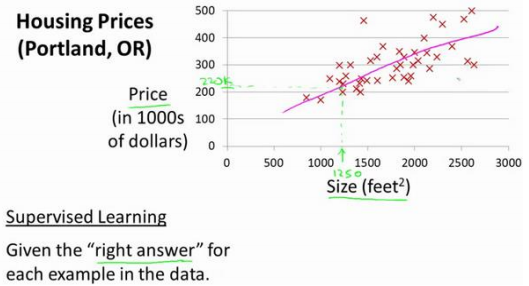
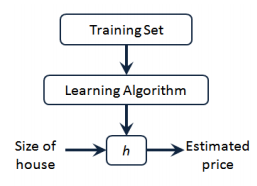
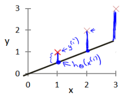
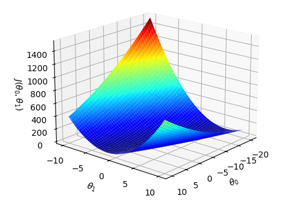
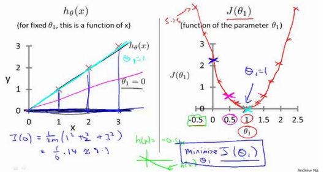
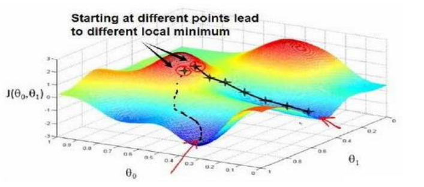
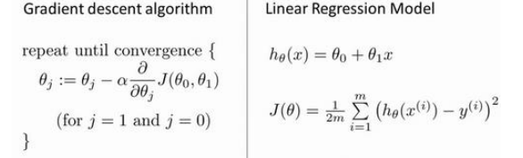
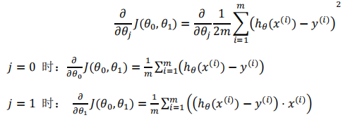
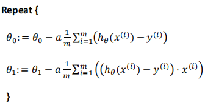

<<<<<<< HEAD
# 机器学习任务攻略

---

符号说明：

​	$m$: 训练样本的数目

​	$x$: 特征变量、输入变量

​	$y$: 目标变量、输出变量

​	$(x,y)$: 训练集中的实例

​	$(x^{(i)}, y^{(i)})$: 第i个观察实例

​	$h$: 学习算法的解决方案或者函数，也称为假设(hypothesis)

---

### 1. 单变量线性回归(Linear Regression with Multiple Variables)

##### 1.1 模型表示

​	例子：对于一个预测住房价格的例子，使用一个数据集，包含某市的住房价格。现在根据不同房屋尺寸所售出的价格，画出一个数据集。比如，一个1250平米大小的住房，需要给出这个房子能卖多少钱，这个过程可以通过一个模型来实现，也许是一条直线或者曲线，从这个数据模型上来看，这个1250平米大小的房子可以卖220000美元，这就是有监督学习的一个例子。

它被称作监督学习是因为对于每个数据来说，我们给出了“正确的答案”，即告诉我们： 根据我们的数据来说，房子实际的价格是多少，而且，更具体来说，这是一个回归问题。回归一词指的是，我们根据之前的数据预测出一个准确的输出值，对于这个例子就是价格，同时，还有另一种最常见的监督学习方式，叫做分类问题，当我们想要预测离散的输出值，例 如，我们正在寻找癌症肿瘤，并想要确定肿瘤是良性的还是恶性的，这就是 0/1 离散输出的问题。更进一步来说，在监督学习中我们有一个数据集，这个数据集被称训练集。 

​		以刚刚谈到的房屋交易问题为例，假设回归问题的数据集如下表所示：

| Size in feet² (x) | Price ($) in 1000's (y) |
| ----------------- | ----------------------- |
| 2104              | 460                     |
| 1416              | 232                     |
| 1534              | 315                     |
| 852               | 178                     |
| ...               | ...                     |

这是一个监督算法的的工作方式，首先把训练集里房屋价格，把它喂给学习算法，然后学习算法输出一个函数，通常表示为小写 ℎ 表示。ℎ 代表 **hypothesis**(**假设**)，ℎ表示一个函数，输入是房屋尺寸大小，就像想出售的房屋，因此 ℎ 根据输入的 𝑥值来得出 𝑦 值，𝑦 值对应房子的价格 因此，ℎ 是一个从𝑥到 𝑦 的函数映射。 

​		选择最初的使用规则ℎ代表 **hypothesis**，因而，要解决房价预测问题，实际上是要将训练集“喂”给学习算法，进而学习得到一个假设ℎ，然后将我们要预测的房屋的尺寸作为输入变量输入给ℎ，预测出该房屋的交易价格作为输出变量输出为结果。那么，对于我们的房价预测问题，我们该如何表达 ℎ？ 

​		一种可能的表达方式是：$h_\theta(x) = \theta_0 + \theta_1 x$，因为只含有一个特征/输入变量，因此这样的问题叫作单变量线性回归问题

##### 1.2 代价函数

`训练集：`

| Size in feet² (x) | Price ($) in 1000's (y) |
| ----------------- | ----------------------- |
| 2104              | 460                     |
| 1416              | 232                     |
| 1534              | 315                     |
| 852               | 178                     |
| ...               | ...                     |

- **Hypothesis**:$h_\theta(x) = \theta_0 + \theta_1 x$
- **Parameters**: $\theta_i's: where (i = 0, 1)$

​		在线性回归中我们有一个像这样的训练集，𝑚代表了训练样本的数量，比如 𝑚 = 47。 而我们的假设函数，也就是用来进行预测的函数，是这样的线性函数形式：$h_\theta(x) = \theta_0 + \theta_1 x$。 其中$\theta_0$是直线的在y轴上的截距，$\theta_1$是直线的斜率。

​		我们选择的参数决定了我们得到的直线相对于我们的训练集的准确程度，模型所预测的值与训练集中实际值之间的差距（下图中蓝线所指）就是**建模误差**（**modeling error**）。 

我们的目标便是选择出可以使得建模误差的平方和能够最小的模型参数， 即，使得代价函数$ J(\theta, \theta_1) = \frac{1}{2m} \sum_{i=1}^{m} \left( h_\theta(x^{(i)}) - y^{(i)} \right)^2$ 最小。

​		绘制一个等高线图，三个坐标分别是$ \theta_0 $和$\theta_1$ 和 $J(\theta, \theta_1)$：

​		则可以看出在三维空间中存在一个使得$J(\theta, \theta_1)$最小的点。

​		代价函数也被称作平方误差函数，有时也被称为平方误差代价函数。我们之所以要求出误差的平方和，是因为误差平方代价函数，对于大多数问题，特别是回归问题，都是一个合理的选择。还有其他的代价函数也能很好地发挥作用，但是平方误差代价函数可能是解决回归问题最常用的手段了。

​		代价函数的数学表示：

`Hypothesis:`
    $h_theta(x) = theta_0 + theta_1 * x$

`Parameters:`
    $theta_0, theta_1$

`Cost Function:`
    $J(theta_0, theta_1) = (1 / (2m)) * sum_{i=1}^{m} (h_theta(x^(i)) - y^(i))^2$

`Goal:`
    minimize $ J(theta_0, theta_1)$  with  respect  to $ theta_0, theta_1$

##### 1.3 梯度下降

​		梯度下降是一个用来求函数最小值的算法，我们将使用梯度下降算法来求出代价函数$ J(theta_0, theta_1)$的最小值。 

​		梯度下降背后的思想是：开始时我们随机选择一个参数的组合$(𝜃_0, 𝜃_1, . . . . . . , 𝜃_𝑛 )$，计算代价函数，然后我们寻找下一个能让代价函数值下降最多的参数组合。我们持续这么做直到到 到一个局部最小值（**local minimum**），因为我们并没有尝试完所有的参数组合，所以不能确定我们得到的局部最小值是否便是全局最小值（**global minimum**），选择不同的初始参数组合，可能会找到不同的局部最小值：

​		想象一下你正站立在山的这一点上，站立在你想象的公园这座红色山上，在梯度下降算法中，我们要做的就是旋转 360 度，看看我们的周围，并问自己要在某个方向上，用小碎步 尽快下山。这些小碎步需要朝什么方向？如果我们站在山坡上的这一点，你看一下周围，你 会发现最佳的下山方向，你再看看周围，然后再一次想想，我应该从什么方向迈着小碎步下山？然后你按照自己的判断又迈出一步，重复上面的步骤，从这个新的点，你环顾四周，并决定从什么方向将会最快下山，然后又迈进了一小步，并依此类推，直到你接近局部最低点的位置。 

​		批量梯度下降（**batch gradient descent**）算法的公式为：

repeat until convergence {
  $ \theta_j := \theta_j - \alpha \frac{\partial}{\partial \theta_j} J(\theta_0, \theta_1) $  (for  j = 0 and j = 1 )
}​

​		其中𝑎是学习率（**learning rate**），它决定了沿着能让代价函数下降程度最大的方向向下迈出的步子有多大，在批量梯度下降中，每一次都同时让所有的参数减去学习速率乘以代价函数的导数。

Correct: Simultaneous update

$temp0 := θ₀ - α∂J(θ₀,θ₁)/∂θ₀  $
$temp1 := θ₁ - α∂J(θ₀,θ₁)/∂θ₁$  
$θ₀ := temp0  $
$θ₁ := temp1   $

​		在梯度下降算法中，还有一个更微妙的问题，梯度下降中，我们要更新𝜃0和𝜃1 ，当 𝑗 = 0 和𝑗 = 1时，会产生更新，所以将会更新𝐽(𝜃0 )和𝐽(𝜃1 )。实现梯度下降算法的微妙之处是， 在这个表达式中，如果你要更新这个等式，你需要同时更新𝜃0和𝜃1：$\theta_0 := \theta_0$ ，并更新$\theta_1 := \theta_1$ 实现方法是：计算公式右边的部分，通过那一部分计算出𝜃0和𝜃1的值，然后同时更新𝜃0和𝜃1。 

##### 1.4 梯度下降的线性回归

​		梯度下降是很常用的算法，它不仅被用在线性回归上和线性回归模型、平方误差代价函数等，还可以将梯度下降和代价函数结合，并且其应用于具体的拟合直线的线性回归算法里。梯度下降算法和线性回归算法比较如图：

对之前的线性回归问题运用梯度下降法，关键在于求出代价函数的导数，即：

则，算法可以被改写成：

对于刚刚使用的算法，有时也称为批量梯度下降。实际上，在机器学习中，通常不太会给算法起名字，但这个名字”**批量梯度下降**”，指的是在梯度下降的每一步中，都用到了所有的训练样本。在梯度下降中，在计算微分求导项时，我们需要进行求和运算，所以，在每一个单独的梯度下降中，我们最终都要计算这样一个东西，这个项需要对所有𝑚个训练样本求和。因此，批量梯度下降法这个名字说明了我们需要考虑所有这一"批"训练样本，而事实上，有时也有其他类型的梯度下降法，不是这种"批量"型的，不考虑整个的训练集，而是每次只关注训练集中的一些小的子集。

=======
# 机器学习任务攻略

---

符号说明：

​	$m$: 训练样本的数目

​	$x$: 特征变量、输入变量

​	$y$: 目标变量、输出变量

​	$(x,y)$: 训练集中的实例

​	$(x^{(i)}, y^{(i)})$: 第i个观察实例

​	$h$: 学习算法的解决方案或者函数，也称为假设(hypothesis)

---

### 1. 单变量线性回归(Linear Regression with Multiple Variables)

##### 1.1 模型表示

​	例子：对于一个预测住房价格的例子，使用一个数据集，包含某市的住房价格。现在根据不同房屋尺寸所售出的价格，画出一个数据集。比如，一个1250平米大小的住房，需要给出这个房子能卖多少钱，这个过程可以通过一个模型来实现，也许是一条直线或者曲线，从这个数据模型上来看，这个1250平米大小的房子可以卖220000美元，这就是有监督学习的一个例子。

它被称作监督学习是因为对于每个数据来说，我们给出了“正确的答案”，即告诉我们： 根据我们的数据来说，房子实际的价格是多少，而且，更具体来说，这是一个回归问题。回归一词指的是，我们根据之前的数据预测出一个准确的输出值，对于这个例子就是价格，同时，还有另一种最常见的监督学习方式，叫做分类问题，当我们想要预测离散的输出值，例 如，我们正在寻找癌症肿瘤，并想要确定肿瘤是良性的还是恶性的，这就是 0/1 离散输出的问题。更进一步来说，在监督学习中我们有一个数据集，这个数据集被称训练集。 

​		以刚刚谈到的房屋交易问题为例，假设回归问题的数据集如下表所示：

| Size in feet² (x) | Price ($) in 1000's (y) |
| ----------------- | ----------------------- |
| 2104              | 460                     |
| 1416              | 232                     |
| 1534              | 315                     |
| 852               | 178                     |
| ...               | ...                     |

这是一个监督算法的的工作方式，首先把训练集里房屋价格，把它喂给学习算法，然后学习算法输出一个函数，通常表示为小写 ℎ 表示。ℎ 代表 **hypothesis**(**假设**)，ℎ表示一个函数，输入是房屋尺寸大小，就像想出售的房屋，因此 ℎ 根据输入的 𝑥值来得出 𝑦 值，𝑦 值对应房子的价格 因此，ℎ 是一个从𝑥到 𝑦 的函数映射。 

​		选择最初的使用规则ℎ代表 **hypothesis**，因而，要解决房价预测问题，实际上是要将训练集“喂”给学习算法，进而学习得到一个假设ℎ，然后将我们要预测的房屋的尺寸作为输入变量输入给ℎ，预测出该房屋的交易价格作为输出变量输出为结果。那么，对于我们的房价预测问题，我们该如何表达 ℎ？ 

​		一种可能的表达方式是：$h_\theta(x) = \theta_0 + \theta_1 x$，因为只含有一个特征/输入变量，因此这样的问题叫作单变量线性回归问题

##### 1.2 代价函数

`训练集：`

| Size in feet² (x) | Price ($) in 1000's (y) |
| ----------------- | ----------------------- |
| 2104              | 460                     |
| 1416              | 232                     |
| 1534              | 315                     |
| 852               | 178                     |
| ...               | ...                     |

- **Hypothesis**:$h_\theta(x) = \theta_0 + \theta_1 x$
- **Parameters**: $\theta_i's: where (i = 0, 1)$

​		在线性回归中我们有一个像这样的训练集，𝑚代表了训练样本的数量，比如 𝑚 = 47。 而我们的假设函数，也就是用来进行预测的函数，是这样的线性函数形式：$h_\theta(x) = \theta_0 + \theta_1 x$。 其中$\theta_0$是直线的在y轴上的截距，$\theta_1$是直线的斜率。

​		我们选择的参数决定了我们得到的直线相对于我们的训练集的准确程度，模型所预测的值与训练集中实际值之间的差距（下图中蓝线所指）就是**建模误差**（**modeling error**）。 

我们的目标便是选择出可以使得建模误差的平方和能够最小的模型参数， 即，使得代价函数$ J(\theta, \theta_1) = \frac{1}{2m} \sum_{i=1}^{m} \left( h_\theta(x^{(i)}) - y^{(i)} \right)^2$ 最小。

​		绘制一个等高线图，三个坐标分别是$ \theta_0 $和$\theta_1$ 和 $J(\theta, \theta_1)$：

​		则可以看出在三维空间中存在一个使得$J(\theta, \theta_1)$最小的点。

​		代价函数也被称作平方误差函数，有时也被称为平方误差代价函数。我们之所以要求出误差的平方和，是因为误差平方代价函数，对于大多数问题，特别是回归问题，都是一个合理的选择。还有其他的代价函数也能很好地发挥作用，但是平方误差代价函数可能是解决回归问题最常用的手段了。

​		代价函数的数学表示：

`Hypothesis:`
    $h_theta(x) = theta_0 + theta_1 * x$

`Parameters:`
    $theta_0, theta_1$

`Cost Function:`
    $J(theta_0, theta_1) = (1 / (2m)) * sum_{i=1}^{m} (h_theta(x^(i)) - y^(i))^2$

`Goal:`
    minimize $ J(theta_0, theta_1)$  with  respect  to $ theta_0, theta_1$

##### 1.3 梯度下降

​		梯度下降是一个用来求函数最小值的算法，我们将使用梯度下降算法来求出代价函数$ J(theta_0, theta_1)$的最小值。 

​		梯度下降背后的思想是：开始时我们随机选择一个参数的组合$(𝜃_0, 𝜃_1, . . . . . . , 𝜃_𝑛 )$，计算代价函数，然后我们寻找下一个能让代价函数值下降最多的参数组合。我们持续这么做直到到 到一个局部最小值（**local minimum**），因为我们并没有尝试完所有的参数组合，所以不能确定我们得到的局部最小值是否便是全局最小值（**global minimum**），选择不同的初始参数组合，可能会找到不同的局部最小值：

​		想象一下你正站立在山的这一点上，站立在你想象的公园这座红色山上，在梯度下降算法中，我们要做的就是旋转 360 度，看看我们的周围，并问自己要在某个方向上，用小碎步 尽快下山。这些小碎步需要朝什么方向？如果我们站在山坡上的这一点，你看一下周围，你 会发现最佳的下山方向，你再看看周围，然后再一次想想，我应该从什么方向迈着小碎步下山？然后你按照自己的判断又迈出一步，重复上面的步骤，从这个新的点，你环顾四周，并决定从什么方向将会最快下山，然后又迈进了一小步，并依此类推，直到你接近局部最低点的位置。 

​		批量梯度下降（**batch gradient descent**）算法的公式为：

repeat until convergence {
  $ \theta_j := \theta_j - \alpha \frac{\partial}{\partial \theta_j} J(\theta_0, \theta_1) $  (for  j = 0 and j = 1 )
}​

​		其中𝑎是学习率（**learning rate**），它决定了沿着能让代价函数下降程度最大的方向向下迈出的步子有多大，在批量梯度下降中，每一次都同时让所有的参数减去学习速率乘以代价函数的导数。

Correct: Simultaneous update

$temp0 := θ₀ - α∂J(θ₀,θ₁)/∂θ₀  $
$temp1 := θ₁ - α∂J(θ₀,θ₁)/∂θ₁$  
$θ₀ := temp0  $
$θ₁ := temp1   $

​		在梯度下降算法中，还有一个更微妙的问题，梯度下降中，我们要更新𝜃0和𝜃1 ，当 𝑗 = 0 和𝑗 = 1时，会产生更新，所以将会更新𝐽(𝜃0 )和𝐽(𝜃1 )。实现梯度下降算法的微妙之处是， 在这个表达式中，如果你要更新这个等式，你需要同时更新𝜃0和𝜃1：$\theta_0 := \theta_0$ ，并更新$\theta_1 := \theta_1$ 实现方法是：计算公式右边的部分，通过那一部分计算出𝜃0和𝜃1的值，然后同时更新𝜃0和𝜃1。 

##### 1.4 梯度下降的线性回归

​		梯度下降是很常用的算法，它不仅被用在线性回归上和线性回归模型、平方误差代价函数等，还可以将梯度下降和代价函数结合，并且其应用于具体的拟合直线的线性回归算法里。梯度下降算法和线性回归算法比较如图：

对之前的线性回归问题运用梯度下降法，关键在于求出代价函数的导数，即：

则，算法可以被改写成：

对于刚刚使用的算法，有时也称为批量梯度下降。实际上，在机器学习中，通常不太会给算法起名字，但这个名字”**批量梯度下降**”，指的是在梯度下降的每一步中，都用到了所有的训练样本。在梯度下降中，在计算微分求导项时，我们需要进行求和运算，所以，在每一个单独的梯度下降中，我们最终都要计算这样一个东西，这个项需要对所有𝑚个训练样本求和。因此，批量梯度下降法这个名字说明了我们需要考虑所有这一"批"训练样本，而事实上，有时也有其他类型的梯度下降法，不是这种"批量"型的，不考虑整个的训练集，而是每次只关注训练集中的一些小的子集。

>>>>>>> e8f268d856d79ef4c95db764d874c7e6a82786d8
